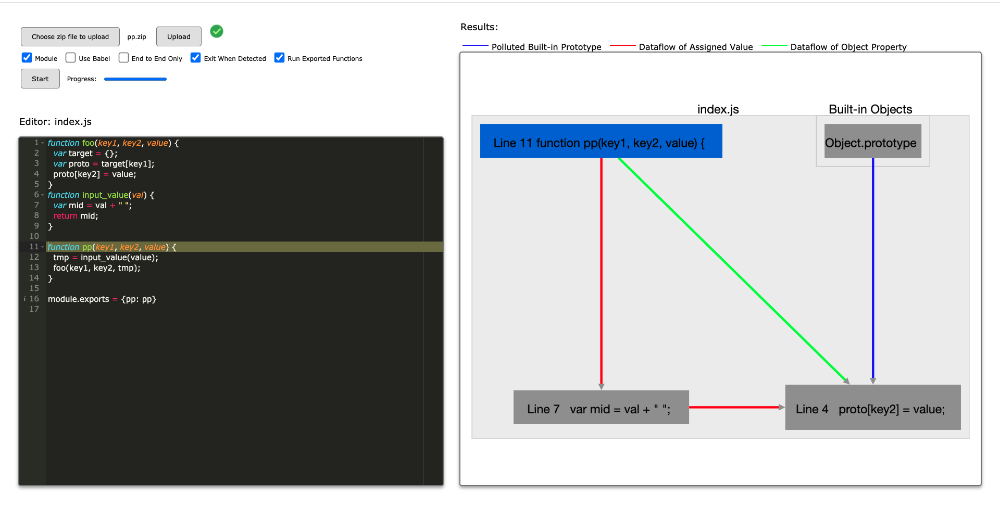
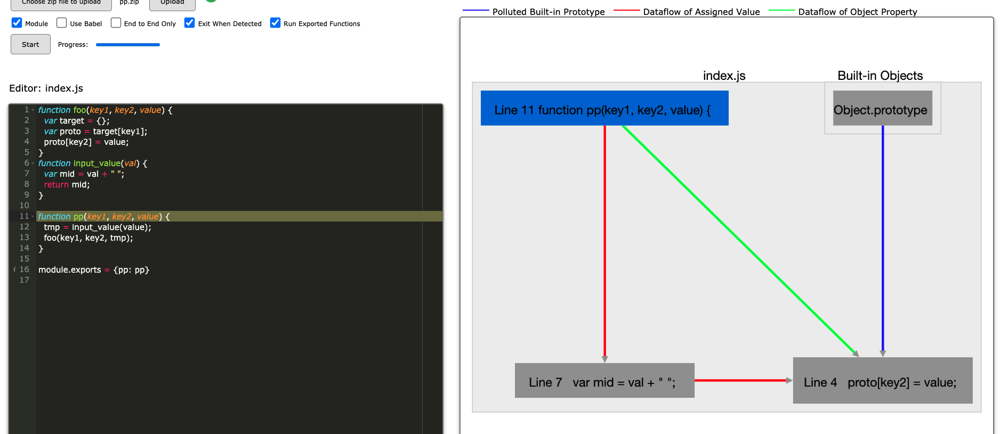

# ObjLupAnsys
ObjLupAnsys is a tool to detect prototype pollution vulnerabilities in Node.js packages. This project is written in Python and JavaScript and the source code is included in the repository. 

## Installation
Please check out [INSTALL.md](https://github.com/Song-Li/ObjLupAnsys/blob/main/INSTALL.md) for the detailed instruction of the installation.

## How to use
ObjLupAnsys provides two interfaces--a command-line-based interface for experts and a Web-based interface for beginners or web users. 

### Command-line 
Use the following arugments to run the tool:

```bash
python3 ObjLupAnsys.py	[-h] [-p] [-m] [-q] [-s] [-a] [--timeout TIMEOUT] [-l LIST] [--install] 
		[--max-rep MAX_REP] [--no-prioritized-funcs] [--nodejs] 
		[--entrance-func ENTRANCE_FUNC] [--pre-timeout PRE_TIMEOUT]
		[--max-file-stack MAX_FILE_STACK] [--skip-func SKIP_FUNC] [--run-env RUN_ENV] 
		[--no-file-based] [--parallel PARALLEL] [input_file]
```

| Argument | Description |
| -------- | ----------- |
| `input_file` | The path to the input file. It can be a Node.js package directory or a JavaScript file |
| `-p, --print` | Print logs to console, instead of files. |
| `-m, --module` | Module mode. Indicate the input is a module, instead of a script. |
| `-q, --exit` | Exit the analysis immediately when vulnerability is found. Do not use this if you need a complete graph. |
| `-s, --single-branch` | Single branch mode (or single execution). If set, ObjLupAnsys will disable the branch-sensitive mode. |
| `-a, --run-all` | Run all exported functions in module.exports of **all** analyzed files even if the file is not the entrance file.|
| `--timeout TIMEOUT`| The timeout(in seconds) of running a single module for one time. (Optimizations may run a module multiple times. This is the timeout for a single run.)|
| `-l, --list LIST`| Run a list of files/packages. Each line of the file contains the path to a file/package. |
| `--install`| Download the source code of a list of packages to the --run-env location. |
| `--max-rep MAX_REP`| If set, every function can only exsits in the call stack for at most MAX_REP times. (To prevent too many levels of recursive calls)| 
| `--no-prioritized-funcs`| If set, ObjLupAnsys will not start from the prioritized functions. |
| `--nodejs`| Node.js mode. Indicate the input is a Node.js package. |
| `--entrance-func ENTRANCE_FUNC`| If set, ObjLupAnsys will analyse the ENTRANCE_FUNC before analyzing the package. |
| `--pre-timeout PRE_TIMEOUT`| The timeout(in seconds) for preparing the environment before running the prioritized functions. Defaults to 30.|
| `--max-file-stack MAX_FILE_STACK`| The max depth of the required file stack. |
| `--skip-func SKIP_FUNC`| Skip a list of functions, separated by "," .|
| `--run-env ENV_DIR` | Set the running environment location.|
| `--no-file-based`| Only detect the vulnerabilities that can be directly accessed from the main entrance of the package. |
| `--parallel PARALLEL`| Run a list of packages parallelly in PARALLEL threads. Only works together with --list argument. |

Once the command is finished, the tool will output the detecting result, and if any vulnerability is found, it will also output the location of the vulnerability and the attack path. The result including three major parts, which are printed in the console with different colors:

- Red color: The data flow path of the user-controlled Assigned Value.
- Green color: The data flow path of the user-controlled Object Property
- Blue color: The pollutable built-in prototypes

### Command-line example
Here is an example to show how to use our command-line based tool:

```shell
$ python3 ./ObjLupAnsys.py -m -a --timeout 300 -q ./tests/packages/pp.js
```

A detailed description of the output will be introduced in the **Example** section.

Or to analyze a Node.js package, you can run a command like:

```shell
$ python3 ./ObjLupAnsys.py --nodejs -a --timeout 300 -q ./tests/packages/set-value
```

### Web-based GUI
The Web-based GUI includes a back-end server and a front-end client. To start the server, you can simply run:

```shell
$ python3 ./start_server.py
```
Once the server is started, you can open your browser and visit the url [http://localhost:9870/](http://localhost:9870/) to access the Web-based GUI. The following steps show how to use our GUI:

1. Click <kbd>Choose zip file to upload</kbd> to pick the zip file of the package. Note that the package should be directly zipped without any sub-folders. In you can not make it work, unzip the example zips included in the **tests/zips** folder and take a look.
2. Click the <kbd>Upload</kbd> button until a green icon appears, which means the zip file is successfully uploaded
3. Select the options. For large packages, we recommend checking "Module". For small packages, we recommend checking "Module" and "Run Exported Functions". For packages that use ES2015 and above features, we recommend checking "Use Babel"
4. Click the  <kbd>Start</kbd> button and wait for the progress bar to finish
5. Once the Results are ready, you should be able to see them in the right part of the webpage in the form of a graph. You can click the components of the graph. We will grep the related source code from the server for you to check.

### Web-based GUI example

We included some zipped example packages in the **tests/zips** folder, you can try any of them. For example, if you want to test the "pp.zip" file, the GUI should be like:



In this GUI tool, the left part includes the configurations and the source code, the right part includes the resulting graph. In the graph, each **dark gray** node indicates a statement and each **light gray** node indicates a file. There are three different type of edges that are marked with three different colors:

- Blue color: the pollutable built-in prototype edges. The start node is the pollutable built-in prototype, and end node is the final location that polluts the built-in prototype
- Red color: the data-flow of the assigned value. 
- Green color: the data-flow of the object property, which indicates the name of the polluted property.

You should be able to click the nodes in the graph. If you do so, the related source code will be shown in the left part.

A detailed explanation of the example is included in the **Example** section.

## Example

**pp** is a JavaScript module that is written by us, which is used to explain the usage of the tool. Let's take a look at the source code:

```javascript
1	function foo(key1, key2, value) {
2	  var target = {};
3	  var proto = target[key1];
4	  proto[key2] = value;
5	}
6	function input_value(val) {
7	  var mid = val + " ";
8	  return mid;
9	}
10
11	function pp(key1, key2, value) {
12	  tmp = input_value(value);
13	  foo(key1, key2, tmp);
14	}
15	
16	module.exports = {pp: pp}
```

In this example, the arguments of the function *pp* will be treated as the input of the module. Inside the function *pp*, at line 12, it first calls the function *input_value* to get the value of the variable *tmp*, and then, at line 13, use the *key1*, *key2* and *tmp* as the parameters of the *foo* call. 

Inside the function *foo*, the *proto* variable defined at line 3 is assigned with the *key1* property of the *target* object. And then the *key2* property of the *proto* object is assigned with the value *value*.

Note that if the *key1* is "\_\_proto\_\_", the variable *proto* defined at line 3 will be the *\_\_proto\_\_* property of *target*, which is equal to the *prototype* property of the built-in *Object* object. If we assign any value *value* to this pointer at line 4, the *key2* property of the *Object.prototype* will be changed to the *value*, which leads to a **prototype pollution**. 

**ObjLupAnsys** will detect those vulnerabilities. The output of the detection includes the data-flow of the assigned value, infected key (Object Property), and which built-in prototype is polluted. 

In the **pp** example, the output of the command-line based interface will be like:

```bash
Prototype pollution detected at node 49 (Line 4)
|Checker| Dataflow of Object Property:
Attack Path:
==========================
$FilePath$ObjLupAnsys/tests/packages/pp.js
Line 11	function pp(key1, key2, value) {
$FilePath$ObjLupAnsys/tests/packages/pp.js
Line 7	  var mid = val + " ";
$FilePath$ObjLupAnsys/tests/packages/pp.js
Line 4	  proto[key2] = value;


|Checker| Dataflow of Assigned Value:
Attack Path:
==========================
$FilePath$ObjLupAnsys/tests/packages/pp.js
Line 11	function pp(key1, key2, value) {
$FilePath$ObjLupAnsys/tests/packages/pp.js
Line 4	  proto[key2] = value;


|Checker| Polluted Built-in Prototype:
Attack Path:
==========================
$FilePath$None
Object.prototype
$FilePath$ObjLupAnsys/tests/packages/pp.js
Line 4	  proto[key2] = value;
```
The output of the Web-based GUI will be like:


Both of the two interfaces clearly show the step-by-step data-flow path that how the prototype pollution happens. From the results, by the blue edge, you can see at line 4, the built-in object *Object.prototype* is polluted. By the green edge, you can see the key *key2* comes from line 11. By the red edges, you can see that the value *value* comes from line 7 with variable *mid*, which is influenced by line 11. 

Note that **ObjLupAnsys** only outputs data-flows, which means that a statement is included in the path only when a new **object** is created and the created object will influence the result. For example, line 7 is included in the result because at line 7, *val + " "* creates a new object. While at line 12, even *tmp* is a new variable, it points to the created object at line 7, and no new object is created at line 12, **ObjLupAnsys** will not include this statement in the result. 

## Optional 
In the **example/fse/** folder, we put a **README.md** file that talks about the detailed steps to reproduce the numbers in the **evaluation** part of the paper. In that file, we will talk more about how to run a list of packages parallelly. This is an optional step and time-consuming. If you are interested, please take a look.
